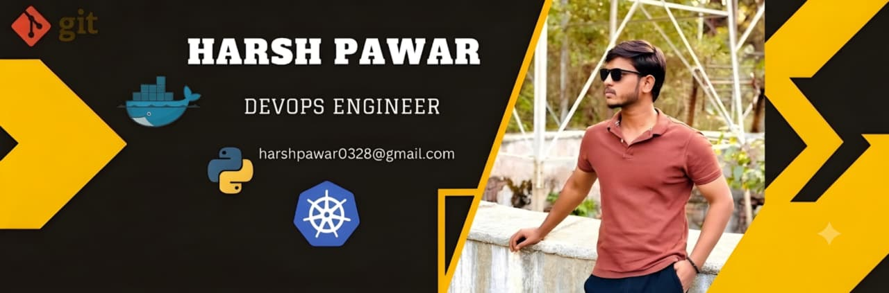

<h1 align="center">Hi 👋, I'm Harsh Pawar</h1>

<h3 align="center">
RHCSA Certified Linux Administrator | AWS Certified Solutions Architect – Associate | DevOps & Cloud Engineer
</h3>

  

---

## 🚀 About Me

- 🎓 MCA Graduate — MET Institute of Engineering, Nashik
- 🏅 RHCSA Certified Linux Administrator (Red Hat Certified System Administrator)
- ☁️ AWS Certified Solutions Architect – Associate (SAA-C03)
- 🐧 Skilled in Linux system administration, shell scripting, and infrastructure troubleshooting
- 🛠️ Building hands-on DevOps and Cloud projects with Docker, Jenkins, Ansible, Kubernetes, and Terraform
- ⚙️ Focused on Infrastructure Automation, CI/CD pipelines, and Cloud Engineering
- 📚 Continuously deepening my DevOps and cloud architecture skills
- 💼 Open to **Linux Administrator**, **Cloud Engineer**, and **DevOps Engineer** roles

---

## 📜 Certifications

| Certification | Issuer |
|---|---|
| 🏅 RHCSA – Red Hat Certified System Administrator | Red Hat |
| ☁️ AWS Certified Solutions Architect – Associate (SAA-C03) | Amazon Web Services |
| 🎓 AWS Academy Cloud Foundations | AWS Academy |
| 🎓 AWS Academy Cloud Architecting | AWS Academy |

---

## 🧰 Tech Stack

---

## 💼 Featured Projects

### 🔹 InfraOps
Linux infrastructure monitoring platform built with Python, Flask, and SQLite — tracks server health metrics and surfaces alerts through a lightweight dashboard.

**Stack:** Python · Flask · SQLite · Linux · Systemd · HTML · CSS
🔗 [github.com/harshpawar2803/infraops](https://github.com/harshpawar2803/infraops)

### 🔹 CloudQueueX
AWS event-driven ticket processing platform built around a decoupled, serverless-friendly architecture.

**Services used:** EC2 · IAM · SQS · SNS · DynamoDB · CloudFormation

### 🔹 LAMP Server Setup
End-to-end configuration of Apache, PHP, and MariaDB on RHEL, covering firewall rules, SELinux contexts, and service hardening.

### 🔹 High-Availability Web Application
Fault-tolerant web app architecture on AWS using Auto Scaling, an Elastic Load Balancer, and EC2 across multiple availability zones.

<!--
Add repo links for CloudQueueX, LAMP Server Setup, and the HA Web App below in this format
so recruiters can click straight through to the code:

🔗 https://github.com/harshpawar2803/repo-name
-->

---

## 🛠️ Skills

**Linux:** User & group management · File permissions · LVM · Package management · Systemd · SSH · Firewalld · SELinux · Cron jobs · Troubleshooting

**Cloud (AWS):** EC2 · VPC · IAM · S3 · RDS · CloudFormation

**DevOps:** Docker · Kubernetes · Jenkins · Git · GitHub · Ansible · Terraform

**Programming:** Python · Bash · SQL

---

## 🎯 Career Goals

- ✅ RHCSA Certified
- ✅ AWS Certified Solutions Architect – Associate
- 🎯 Complete RHCE (Red Hat Certified Engineer)
- 🎯 Master Kubernetes for container orchestration
- 🎯 Master Terraform for Infrastructure as Code
- 🎯 Build enterprise-grade DevOps CI/CD pipelines
- 🎯 Land a role as a Cloud & DevOps Engineer

---

## 📊 GitHub Stats

## 📈 GitHub Activity

---

## 🌐 Connect With Me

&nbsp;

📧 harshpawar0328@gmail.com &nbsp;|&nbsp; 📱 +91 9096944522 &nbsp;|&nbsp; 📍 Nashik, Maharashtra, India

---

<i>"Keep Learning. Keep Building. Keep Growing." 🚀</i>

⭐ If you find my repositories useful, consider giving them a star ⭐

